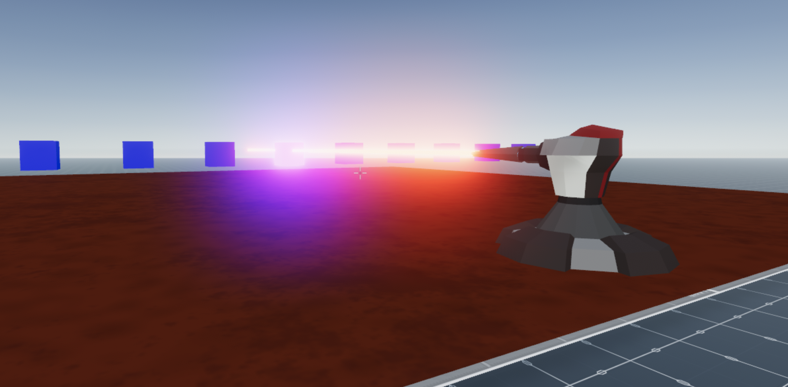

## Laser ray casting

A scene that shows how [ray casting](https://docs.decentraland.org/development-guide/raycasting/) can be used to trace an imaginary line in space and check for object collision.




This scene shows you:

- How to use ray cast to check if an entity intersects with a line in space
- How to use ray cast to check if an entity is being pointed at by the player
- How to change a material on a primitive shape
- How to use a system to keep moving multiple entities as in a conveyor

## Try it out

**Install the CLI**

Download and install the Decentraland CLI by running the following command:

```bash
npm i -g decentraland
```

**Previewing the scene**

Download this example and navigate to its directory, then run:

```
$:  dcl start
```

Any dependencies are installed and then the CLI opens the scene in a new browser tab.

**Scene Usage**

Notice that boxes that intersect with the laser change their material and become emissive while being hit. Also, if you point your cursor at a box it will change its color to green.

Learn more about how to build your own scenes in our [documentation](https://docs.decentraland.org/) site.

If something doesn’t work, please [file an issue](https://github.com/decentraland-scenes/Awesome-Repository/issues/new).

## Copyright info

This scene is protected with a standard Apache 2 licence. See the terms and conditions in the [LICENSE](/LICENSE) file.
